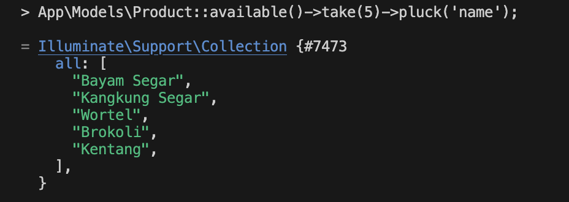
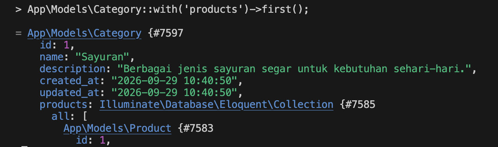
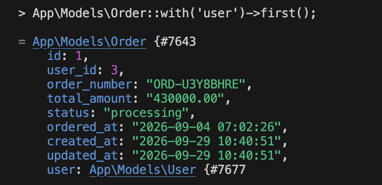
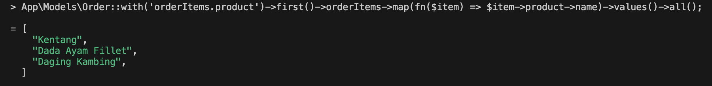
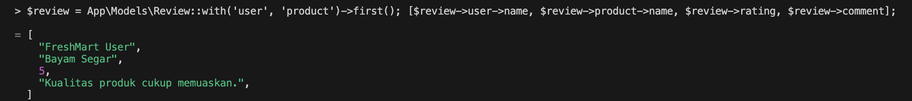

# FreshMart — E-Commerce

FreshMart adalah aplikasi e-commerce sederhana untuk penjualan bahan pokok dan bahan segar yang dibuat menggunakan Laravel.

## Fitur

- Authentication: Register, Login, Logout
- Multi-role: Admin, Editor, User
- Role-based access control
- Product CRUD
- Product Policy untuk authorization
- Database & Eloquent Relationship
- Seeder & Factory dengan 50+ produk
- Pagination
- Validasi form
- Eager Loading
- Scope `available()`

## Role & Akses

| Role | Edit Produk | Hapus Produk |
|------|-------------|--------------|
| Admin | ✓ | ✓ |
| Editor | ✓ | ✗ |
| User | ✗ | ✗ |

## Database

Project menggunakan 7 tabel:

- users
- categories
- products
- orders
- order_items
- payments
- reviews

Terdapat 8 kategori dan 51 produk hasil seeding.

## Filament Admin Panel

Admin panel menggunakan Filament untuk mengelola data:

- Products
- Categories
- Users

## Dokumentasi Tinker

### Query 1 — Scope Available

### Query 2 — Category & Products

### Query 3 — Order & User

### Query 4 — Order, Order Items & Product

### Query 5 — Review, User & Product

